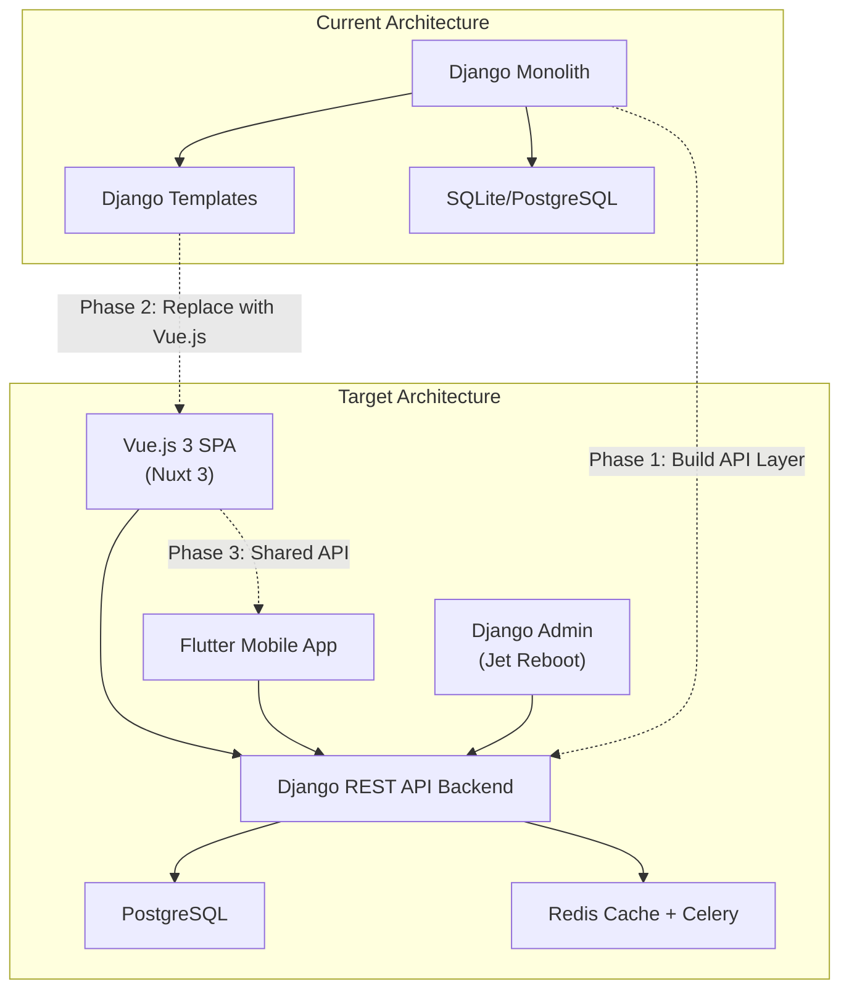
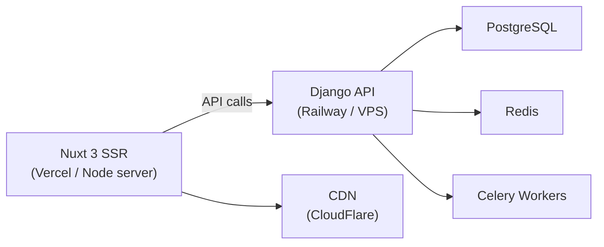

# Binco Ecommerce — Full Modernization & Feature Completion Plan

## Current State Analysis

After analyzing all 11 Django apps, 30+ models, and 45+ views/endpoints, here is the current architecture:

| Component | Technology | Status |
|---|---|---|
| Backend | Django 6.0 (monolithic views + templates) | ✅ Working |
| Frontend | Django Templates + Bootstrap + CSS | ✅ Working (tightly coupled) |
| Database | SQLite (dev) / PostgreSQL (prod via `dj-database-url`) | ✅ Working |
| Admin | Django Jet Reboot | ✅ Working |
| Auth | Django built-in (session-based) | ✅ Working |
| Notifications | Multi-channel (email, SMS, push, in-app) | ✅ Working |

### Existing Features Inventory

| Module | Features |
|---|---|
| **Catalog** | Products, Categories, Colors, Sizes, Variations, Gallery Images |
| **Cart** | Add/Update/Remove items, Coupons, Session-based guest cart |
| **Orders** | Checkout (COD only), Order history, Invoice PDF, Return flow, Status tracking |
| **Accounts** | Register, Login/Logout, Profile, Dashboard |
| **Seller** | Apply to sell, Seller dashboard (earnings, charts), Product CRUD, Order management |
| **Reviews** | Star ratings, Comments (one per user per product) |
| **Wishlist** | Add/Remove products |
| **CMS** | Sliders, Banners, Promotion cards, Blog articles, About page, Static pages, Testimonials |
| **Reports** | Admin analytics dashboard, CSV/Excel export |
| **SiteConfig** | General settings, Currency/Tax, Payment gateways, Email/SMS config, Website styles, Promo banners |
| **Notifications** | In-app, Email, SMS, Push subscriptions, Templates |

---

## Feature Gap Analysis

> [!IMPORTANT]
> The following critical features are **missing or incomplete** for a production-ready multivendor ecommerce platform. These gaps must be addressed regardless of the frontend technology.

### 🔴 Critical Missing Features

| # | Feature | Gap Description |
|---|---|---|
| 1 | **Payment Gateway Integration** | *(Deferred to future phase)* Only COD works currently. |
| 2 | **Seller Payout/Commission System** | *(Deferred to future phase)* No commission model or payout tracking yet. |
| 3 | **Seller Store Pages** | No public-facing seller profile/store page. Customers can't browse by seller. |
| 4 | **Address Book** | Users have one address in profile. No saved addresses, no address selection at checkout. |
| 5 | **Order Tracking (Real)** | `track_order` view renders an empty template. No tracking number, no carrier integration. |
| 6 | **Search (Full-Text)** | Basic `icontains` filtering. No relevance ranking, no autocomplete, no search suggestions. |
| 7 | **Pagination** | Zero pagination anywhere — product list, order history, reviews, notifications. Will break at scale. |
| 8 | **Email Verification** | No email verification on registration. No password reset flow. |
| 9 | **Product Attributes System** | Only color/size. No support for custom attributes (material, weight, brand, etc.). |
| 10 | **Seller Verification/KYC** | Seller approval is a boolean toggle. No documents, no verification workflow. |

### 🟡 Important Missing Features

| # | Feature | Gap Description |
|---|---|---|
| 11 | **Inventory Alerts** | No low-stock notifications for sellers. |
| 12 | **Shipping Integration** | No carrier API (Pathao, Steadfast, RedX). Only flat-rate shipping config. |
| 13 | **Chat/Messaging** | No buyer-seller communication system. |
| 14 | **Product Q&A** | No product questions/answers feature. |
| 15 | **Multi-Image Upload for Reviews** | Reviews are text + rating only. No image upload. |
| 16 | **Seller Analytics** | Basic seller dashboard with earnings. No product-level analytics, traffic data, or conversion rates. |
| 17 | **Refund Processing** | Return flow exists but no actual refund workflow (refund amount, method, status). |
| 18 | **SEO System** | No per-product or per-page meta title/description management. |
| 19 | **Bulk Product Operations** | No CSV/Excel import/export for products. |
| 20 | **Social Login** | No Google/Facebook OAuth integration. |
| 21 | **Admin Seller Management** | No admin panel to view seller performance, commission summaries, or approve payouts. |
| 22 | **Flash Sales / Deals Timer** | `discount_price` exists but no time-limited deals or countdown system. |
| 23 | **Product Comparison** | No compare feature. |
| 24 | **Recently Viewed Products** | No tracking of user's browsing history. |

---

## Architecture Decision



> [!IMPORTANT]
> **Key Architecture Decision**: The Django backend will be converted from a template-rendering monolith to a **REST API server** using Django REST Framework (DRF). The existing Django Admin (Jet Reboot) will continue to work unchanged. The Vue.js frontend and Flutter app will both consume the same REST API.

---

## Phase-wise Implementation Plan

---

### Phase 1 — Django REST API Layer + Critical Backend Gaps
**Duration: 4–6 weeks** | **Priority: Highest**

> [!NOTE]
> This phase keeps the existing Django templates working while building the API layer alongside them. Nothing breaks — we only add.
> *Note: Payment Gateway integration and Seller Payout system have been deferred to a future phase per user request.*

#### 1.1 Project Setup & Infrastructure

##### [NEW] `requirements-api.txt` (or update `requirements.txt`)
- Add: `djangorestframework`, `djangorestframework-simplejwt`, `django-cors-headers`, `django-filter`, `drf-spectacular` (OpenAPI docs), `redis`, `celery`

##### [MODIFY] [settings.py](file:///d:/My%20Works/Binco_Ecommerce/bincoecom/settings.py)
- Add DRF, CORS headers, SimpleJWT, django-filter to `INSTALLED_APPS`
- Configure JWT authentication settings
- Configure CORS for Vue.js dev server (`localhost:3000`)
- Add Redis cache backend and Celery broker config

##### [NEW] `bincoecom/api_urls.py`
- Central API URL router under `/api/v1/`
- Keeps existing template URLs untouched

##### [MODIFY] [urls.py](file:///d:/My%20Works/Binco_Ecommerce/bincoecom/urls.py)
- Add `path('api/v1/', include('bincoecom.api_urls'))`
- Add OpenAPI schema endpoint (`/api/docs/`)

---

#### 1.2 Serializers & API Endpoints (per app)

##### **Auth & Accounts API** — `accounts/api/`

| Endpoint | Method | Description |
|---|---|---|
| `/api/v1/auth/register/` | POST | User registration + email verification |
| `/api/v1/auth/login/` | POST | JWT token pair (access + refresh) |
| `/api/v1/auth/refresh/` | POST | Refresh JWT access token |
| `/api/v1/auth/logout/` | POST | Blacklist refresh token |
| `/api/v1/auth/password-reset/` | POST | Initiate password reset |
| `/api/v1/auth/password-reset-confirm/` | POST | Confirm password reset |
| `/api/v1/auth/verify-email/` | POST | Email verification |
| `/api/v1/auth/social/google/` | POST | Google OAuth login |
| `/api/v1/auth/social/facebook/` | POST | Facebook OAuth login |
| `/api/v1/users/me/` | GET/PUT | User profile + addresses |
| `/api/v1/users/me/addresses/` | GET/POST/PUT/DELETE | Address book CRUD |
| `/api/v1/users/me/become-seller/` | POST | Apply to become a seller |

##### **Catalog API** — `catalog/api/`

| Endpoint | Method | Description |
|---|---|---|
| `/api/v1/products/` | GET | Product listing with pagination, filters, full-text search |
| `/api/v1/products/{slug}/` | GET | Product detail with variations, images, reviews |
| `/api/v1/products/search-suggestions/` | GET | Autocomplete search |
| `/api/v1/categories/` | GET | Category tree |
| `/api/v1/categories/{slug}/products/` | GET | Products by category |

##### **Cart API** — `cart/api/`

| Endpoint | Method | Description |
|---|---|---|
| `/api/v1/cart/` | GET | Get user's cart with items |
| `/api/v1/cart/items/` | POST | Add item to cart |
| `/api/v1/cart/items/{id}/` | PUT/DELETE | Update quantity / remove |
| `/api/v1/cart/coupon/` | POST/DELETE | Apply / remove coupon |

##### **Orders API** — `orders/api/`

| Endpoint | Method | Description |
|---|---|---|
| `/api/v1/orders/` | GET/POST | List orders / Place order (checkout) |
| `/api/v1/orders/{id}/` | GET | Order detail |
| `/api/v1/orders/{id}/invoice/` | GET | Download invoice PDF |
| `/api/v1/orders/{id}/return/` | POST | Request return |
| `/api/v1/orders/{id}/track/` | GET | Tracking info |

##### **Reviews API** — `reviews/api/`

| Endpoint | Method | Description |
|---|---|---|
| `/api/v1/products/{id}/reviews/` | GET/POST | List / Submit review |

##### **Wishlist API** — `wishlist/api/`

| Endpoint | Method | Description |
|---|---|---|
| `/api/v1/wishlist/` | GET | Get wishlist |
| `/api/v1/wishlist/{product_id}/` | POST/DELETE | Toggle product |

##### **CMS API** — `cms/api/`

| Endpoint | Method | Description |
|---|---|---|
| `/api/v1/cms/sliders/` | GET | Homepage sliders |
| `/api/v1/cms/banners/` | GET | Banners |
| `/api/v1/cms/promotions/` | GET | Promotion cards |
| `/api/v1/cms/articles/` | GET | Blog list |
| `/api/v1/cms/articles/{slug}/` | GET | Article detail |
| `/api/v1/cms/about/` | GET | About page content |
| `/api/v1/cms/pages/{slug}/` | GET | Static page |
| `/api/v1/cms/testimonials/` | GET | Testimonials |

##### **Notifications API** — `notifications/api/`

| Endpoint | Method | Description |
|---|---|---|
| `/api/v1/notifications/` | GET | User's notifications (paginated) |
| `/api/v1/notifications/{id}/read/` | POST | Mark as read |
| `/api/v1/notifications/read-all/` | POST | Mark all as read |
| `/api/v1/notifications/count/` | GET | Unread count |
| `/api/v1/notifications/push/subscribe/` | POST | Register push subscription |

##### **Seller API** — `seller/api/`

| Endpoint | Method | Description |
|---|---|---|
| `/api/v1/seller/dashboard/` | GET | Seller dashboard stats |
| `/api/v1/seller/products/` | GET/POST | Seller's products CRUD |
| `/api/v1/seller/products/{id}/` | PUT/DELETE | Edit/Delete product |
| `/api/v1/seller/orders/` | GET | Orders containing seller's items |
| `/api/v1/seller/orders/{id}/status/` | PUT | Update order status |
| `/api/v1/seller/store/` | GET/PUT | Seller public store settings |
| `/api/v1/seller/analytics/` | GET | Sales analytics |

##### **Site Config API** — `siteconfig/api/`

| Endpoint | Method | Description |
|---|---|---|
| `/api/v1/config/general/` | GET | Site name, logo, social links, etc. |
| `/api/v1/config/currency/` | GET | Currency symbol, position, tax info |
| `/api/v1/config/payment-methods/` | GET | Available payment methods |
| `/api/v1/config/styles/` | GET | Website style settings |

---

#### 1.3 Critical Backend Feature Additions

##### [NEW] `accounts/models.py` — Address Model
```python
class UserAddress(models.Model):
    user = models.ForeignKey(User, on_delete=models.CASCADE, related_name='addresses')
    label = models.CharField(max_length=50)  # Home, Office, etc.
    full_name = models.CharField(max_length=200)
    phone = models.CharField(max_length=20)
    address = models.TextField()
    city = models.CharField(max_length=100)
    postal_code = models.CharField(max_length=20)
    is_default = models.BooleanField(default=False)
```

*(Note: Seller Commission & Payout models are deferred)*

##### [NEW] `accounts/models.py` — Seller Verification
```python
class SellerVerification(models.Model):
    user = models.OneToOneField(User, ...)
    business_name = models.CharField(...)
    national_id = models.ImageField(...)
    trade_license = models.ImageField(...)
    verification_status = models.CharField(...)  # pending, approved, rejected
```

##### [MODIFY] [orders/models.py](file:///d:/My%20Works/Binco_Ecommerce/orders/models.py) — Add Tracking & Refund
```python
# Add to Order model:
tracking_number = models.CharField(max_length=100, blank=True)
carrier = models.CharField(max_length=50, blank=True)
refund_amount = models.DecimalField(default=0)
refund_status = models.CharField(...)  # none, pending, processed
```

*(Note: Payment Gateway Integrations are deferred to a future phase)*

##### Pagination — Add globally to DRF settings
```python
REST_FRAMEWORK = {
    'DEFAULT_PAGINATION_CLASS': 'rest_framework.pagination.PageNumberPagination',
    'PAGE_SIZE': 20,
}
```

---

### Phase 2 — Vue.js Frontend (SPA)
**Duration: 4–5 weeks** | **Priority: High**

> [!NOTE]
> Based on your choices, we will build a pure Single Page Application (SPA) using **Vite + Vue 3**. Once this frontend is complete and fully functional, we will permanently remove the old Django HTML templates.

#### 2.1 SPA Initialization & Routing
- Set up a new Vite + Vue 3 project (e.g., `frontend/` directory).
- Configure Vue Router for all pages (Home, Shop, Product Detail, Cart, Checkout, Dashboard, etc.).
- Set up state management using Pinia (Cart state, User Auth state, Settings state).
- Set up Axios or Fetch API wrapper with JWT interceptors (auto-refresh tokens).
- **Icons**: Iconify
- **CSS**: Which CSS framework would you like to use for the project (e.g., TailwindCSS, Bootstrap, or custom CSS)?

#### 2.2 Pages & Components Mapping

| Current Django Template | Vue.js Page/Route |
|---|---|
| `store/home.html` | `/` — Home page |
| `store/product_list.html` | `/products` — Product listing + filters |
| `store/product_detail.html` | `/product/:slug` — Product detail |
| `store/cart.html` | `/cart` — Shopping cart |
| `store/checkout.html` | `/checkout` — Checkout flow |
| `store/order_success.html` | `/order/success/:id` |
| `store/orders.html` | `/account/orders` |
| `store/order_detail.html` | `/account/orders/:id` |
| `store/wishlist.html` | `/account/wishlist` |
| `store/seller_dashboard.html` | `/seller/dashboard` |
| `store/seller_products.html` | `/seller/products` |
| `store/seller_orders.html` | `/seller/orders` |
| `store/product_form.html` | `/seller/products/new`, `/seller/products/:id/edit` |
| `accounts/register.html` | `/auth/register` |
| `accounts/login.html` | `/auth/login` |
| `accounts/dashboard.html` | `/account/dashboard` |
| `accounts/profile.html` | `/account/profile` |
| `cms/article_list.html` | `/blog` |
| `cms/article_detail.html` | `/blog/:slug` |
| `cms/about.html` | `/about` |
| `cms/contact.html` | `/contact` |
| `notifications/notification_list.html` | `/account/notifications` |

#### 2.3 Key Frontend Features

- **Reactive Cart**: Real-time cart updates using Pinia store
- **Infinite Scroll / Pagination**: Product listing with lazy loading
- **Search with Autocomplete**: Debounced search with live suggestions
- **Image Zoom**: Product image gallery with pinch-to-zoom
- **Dark Mode**: Toggle with CSS variables
- **Toast Notifications**: Global notification system
- **Real-time Notifications**: WebSocket or SSE for live notification count
- **Skeleton Loading**: Loading states for all data-fetched components
- **PWA Support**: Offline-capable with service worker
- **Multi-language Ready**: Vue i18n setup (Bangla + English)

#### 2.4 Deployment Architecture



---

### Phase 3 — Flutter Mobile App
**Duration: 8–10 weeks** | **Priority: Medium**

> [!NOTE]
> The Flutter app shares the same REST API built in Phase 1. No additional backend work needed unless push notifications require Firebase.

#### 3.1 Project Setup

##### [NEW] `mobile/` — Flutter Project
- **State Management**: Riverpod 2
- **HTTP**: Dio + Retrofit
- **Auth**: flutter_secure_storage for JWT tokens
- **Push Notifications**: Firebase Cloud Messaging (FCM)
- **Image Caching**: cached_network_image
- **Navigation**: GoRouter

#### 3.2 Screen Mapping

| Screen | Description |
|---|---|
| Splash & Onboarding | App intro slides (first launch) |
| Auth Flow | Login, Register, Forgot Password, OTP |
| Home | Sliders, Featured products, Categories, Deals |
| Product Listing | Grid/List view, Filters, Sort, Search |
| Product Detail | Gallery, Variations, Reviews, Add to cart |
| Cart | Items, Coupon, Totals, Checkout button |
| Checkout | Address selection, Payment method, Place order |
| Order History | List of orders with status badges |
| Order Detail | Items, Tracking, Invoice download |
| Profile | Edit profile, Address book |
| Wishlist | Saved products grid |
| Notifications | In-app notification center |
| Seller Dashboard | Earnings, Charts, Quick stats |
| Seller Products | CRUD product management |
| Seller Orders | Order management with status update |

#### 3.3 Platform-Specific Features
- **Push Notifications** via Firebase
- **Biometric Login** (fingerprint/face)
- **Camera Integration** for seller product photos
- **Share Product** via native share sheet
- **Deep Linking** to product/order pages
- **Offline Caching** for product browsing

---

### Phase 4 — Advanced Features & Polish
**Duration: 4–6 weeks** | **Priority: Low (post-launch)**

| Feature | Description |
|---|---|
| **Real-time Chat** | WebSocket-based buyer-seller messaging (Django Channels) |
| **Product Q&A** | Questions/Answers on product pages |
| **Flash Sales** | Time-limited deals with countdown timers |
| **Product Comparison** | Side-by-side comparison (up to 4 products) |
| **Recently Viewed** | Session/user-based browsing history |
| **Bulk Product Import** | CSV/Excel upload for sellers |
| **Affiliate System** | Referral links with commission tracking |
| **Advanced Analytics** | Seller traffic, conversion rates, customer demographics |
| **Multi-Currency** | Dynamic currency conversion |
| **Review Images** | Allow customers to upload photos with reviews |
| **AI Recommendations** | "Customers also bought" using collaborative filtering |

---

## Technology Stack Summary

| Layer | Technology | Purpose |
|---|---|---|
| **Backend API** | Django 6 + DRF | REST API, Business logic |
| **Auth** | SimpleJWT | Token-based auth for SPA + Mobile |
| **Database** | PostgreSQL 16 | Primary database |
| **Cache** | Redis | Caching, Session store, Celery broker |
| **Task Queue** | Celery | Email, SMS, async jobs |
| **API Docs** | drf-spectacular | Auto-generated OpenAPI/Swagger docs |
| **Web Frontend** | Nuxt 3 (Vue 3) | SSR-capable SPA |
| **Mobile App** | Flutter 3 | iOS + Android |
| **Push** | Firebase Cloud Messaging | Mobile push notifications |
| **File Storage** | S3 / Cloudflare R2 | Media storage (production) |
| **CI/CD** | GitHub Actions | Automated testing + deployment |

---

## Open Questions

> [!IMPORTANT]
> **These decisions will affect the implementation approach. Please review before I begin.**

1. **CSS Framework**: For question #2 about CSS, you answered "Yes". Did you mean you'd like to use **TailwindCSS**? (My system defaults to Vanilla CSS unless you specify otherwise).

2. **Backend Migrations**: Have you been able to successfully run `python manage.py makemigrations` and `python manage.py migrate` in your terminal to finalize Phase 1?

---

## Verification Plan

### Automated Tests
- Unit tests for all API serializers and views using `pytest-django`
- Integration tests for payment flows
- `python manage.py test` after each phase
- Frontend: Vitest for Vue component tests

### Manual Verification
- API testing via Swagger UI (`/api/docs/`)
- Cross-browser testing for Vue.js frontend
- Mobile testing on physical Android + iOS devices
- Load testing with `locust` for API endpoints
